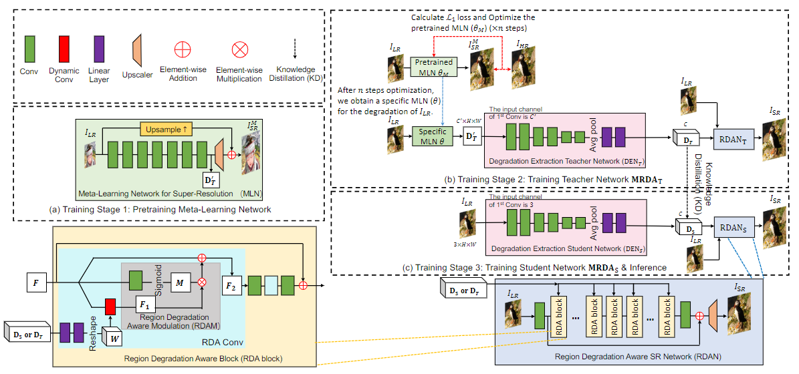
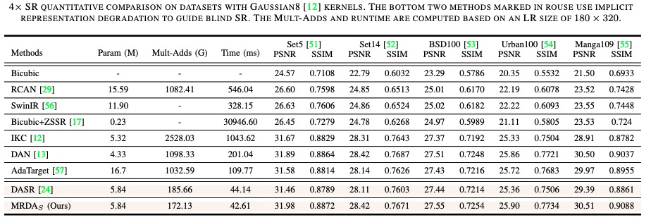
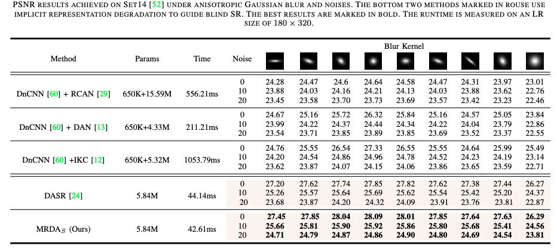

# MRDA


This project is the official implementation of 'Meta-Learning based Degradation Representation for Blind Super-Resolution', TIP2023
> **Meta-Learning based Degradation Representation for Blind Super-Resolution [[Paper](https://arxiv.org/pdf/2207.13963.pdf)] [[Project](https://github.com/Zj-BinXia/MRDA)]**

This is code for MRDA (for classic degradation model, ie y=kx+n)

<p align="center">
  
</p>

---

##  Dependencies and Installation

- Python >= 3.8 (Recommend to use [Anaconda](https://www.anaconda.com/download/#linux) or [Miniconda](https://docs.conda.io/en/latest/miniconda.html))
- [PyTorch >= 1.10](https://pytorch.org/)

## Dataset Preparation

We use DF2K, which combines [DIV2K](https://data.vision.ee.ethz.ch/cvl/DIV2K/) (800 images) and [Flickr2K](https://github.com/LimBee/NTIRE2017) (2650 images).

---

## Training (4 V100 GPUs)

1. train Meta-Learning Network (MLN) bicubic pretraining 

```bash
sh main_stage1.sh
```

### Isotropic Gaussian Kernels


2. we train MLN using meta-learning scheme. **It is notable that modify the ''pre_train'' of main_stage2.sh  to the path of trained main_stage1 checkpoint.** Then, we run

```bash
sh main_stage2.sh
```

3. we train MLN with teacher MRDA_T together. **It is notable that modify the ''pre_train_meta'' of main_stage3.sh  to the path of trained main_stage2 checkpoint.** Then, we run

```bash
sh main_stage3.sh
```


4. we train student MRDA_S. **It is notable that modify the ''pre_train_meta'' of main_stage3.sh  to the path of trained main_stage2 checkpoint. ''pre_train_TA'' and ''pre_train_ST'' are both set to the path of trained main_stage3 checkpoint..** Then, we run

```bash
sh main_stage4.sh
```

### Anisotropic Gaussian Kernels plus noise

1. We train KDSRT ( using L1 loss)

```bash
sh main_anisonoise_KDSRsMx4_stage3.sh
```

2. we train KDSRS (using L1 loss and KD loss). **It is notable that modify the ''pre_train_TA'' and ''pre_train_ST'' of main_anisonoise_KDSRsMx4_stage4.sh  to the path of trained KDSRT checkpoint.** Then, we run

```bash
sh main_anisonoise_KDSRsMx4_stage4.sh
```

---

## :european_castle: Model Zoo

Please download checkpoints from [Google Drive].

---

## Testing

### Isotropic Gaussian Kernels

```bash
sh test_iso_stage4.sh
```

### Anisotropic Gaussian Kernels plus noise

```bash
sh test_anisoAnoise_stage4.sh
```

---

## Results
<p align="center">
  
</p>

<p align="center">
  
</p>


---

## BibTeX

    @article{xia2022meta,
      title={Meta-learning based degradation representation for blind super-resolution},
      author={Xia, Bin and Tian, Yapeng and Zhang, Yulun and Hang, Yucheng and Yang, Wenming and Liao, Qingmin},
      journal={IEEE Transactions on Image Processing},
      year={2023}
    }

